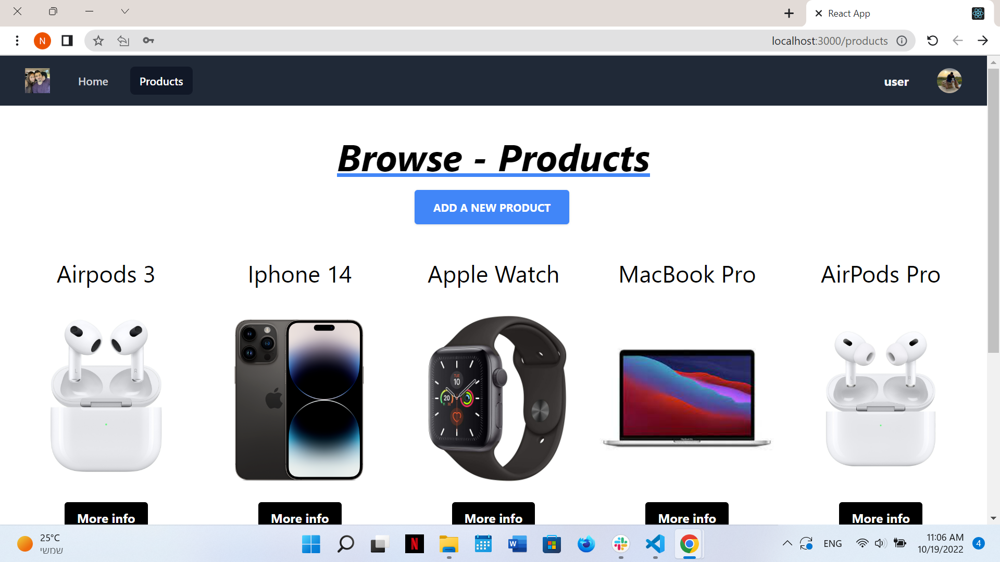

# ReMarket

https://remarket-client.netlify.app

ReMarket is a bidding website. In the website, each user can create his own account and upload an item/items, that he's willing to sell. There is an option to bid the items that other users uploaded, and see your item current highest bid.
Each item has a last date to the bid.

## Table Of Contents

- [ReMarket](#ReMarket)
  - [Why was ReMarket made](#Why-was-ReMarket-made)
  - [Running the project](#running-the-project)
  - [Screenshots](#screenshots)
    - [ReMarket products](#ReMarket-products)
  - [Technologies](#technologies)
    - [Client-Side](#client-side)
    - [Server-Side](#server-side)
  - [Whats Next](#whats-next)

## Why was ReMarket made

ReMarket was made as a part of a FullStack course in order to understand better the security and authentication of a web aplication

## Running the project

1. Clone the repo.
2. Run `npm install`.
3. enter the server folder.
4. run `nodemon server.js`.
5. go back to the root folder.
6. Run `npm start`.
7. Navigate to `http://localhost:3000`.

## Screenshots

### ReMarket products

All of the products for sale, bid the one you like!

## Technologies:

### Client-side:

- React.JS
- Redux
- TailWind
- Axios

### Server-side:

- Node.JS
- Express
- MongooDB
- JWT

## What's next:

1. Interactive filtering system with featured products.
2. Improved UI.
